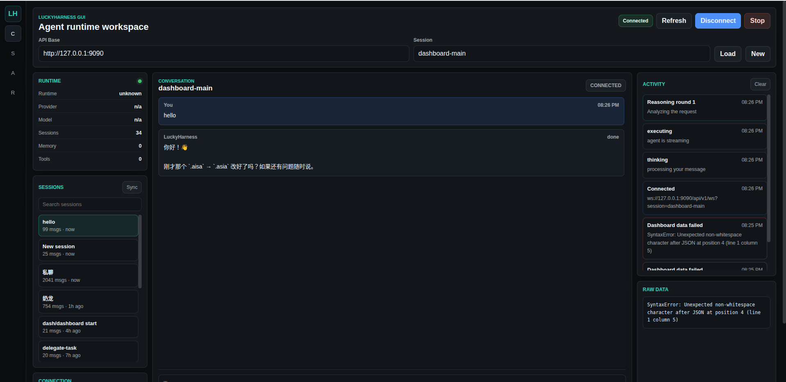
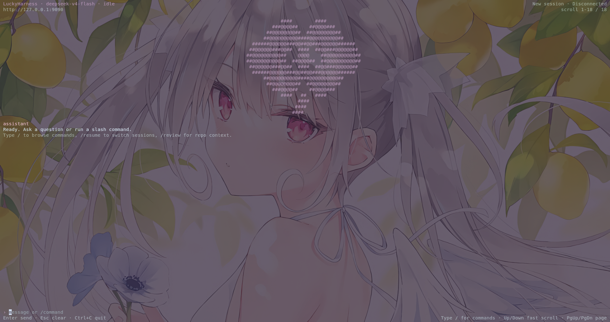
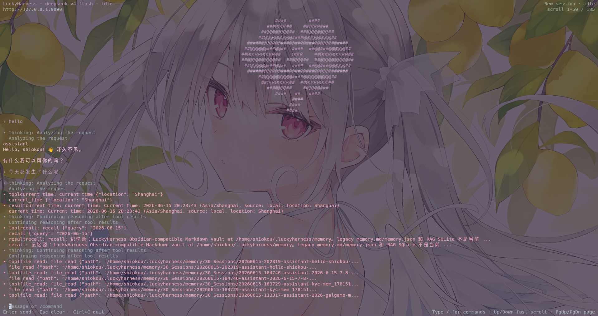
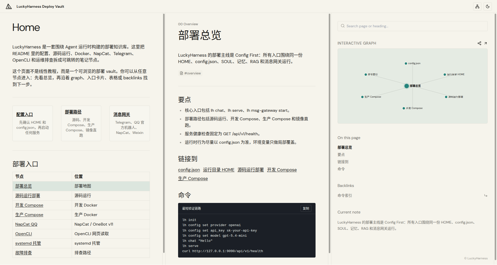

# LuckyHarness

LuckyHarness 不是一个只把聊天窗口包装起来的 Agent 演示项目。它用 Go 写成，把 API 服务、TUI、GUI 网关和多种社交软件入口放在同一个运行时里，让一个 Agent 可以从本地命令行一路走到长期在线的消息服务。

现在这个项目最值得关注的两条线，一条是记忆系统：它试图让 Agent 不只响应眼前这一轮输入，也能在长期使用中积累背景、事实和决策轨迹。另一条是多 Agent 编排能力：工具、模型、任务和消息入口都围绕统一运行时组织，方便把更复杂的协作流程落到真实部署里。

## 界面预览

LuckyHarness 除了 CLI 和 API，也提供面向运行态的 GUI、TUI 和部署知识库视图。GUI 适合观察会话、运行状态和实时活动流；TUI 适合在终端里持续对话、切换会话和执行常用 `lh` 命令；部署知识库用于把配置、运行目录、Compose、消息网关和排障路径整理成可浏览的文档。









## 品牌定位

LuckyHarness 的设计顺序很直接：先让 Bot 能稳定运行，再把同一个核心接到 CLI、API、Telegram、QQ、NapCat、微信等入口。它不希望每个入口都长出一套自己的逻辑，而是让它们共享同一份配置、同一个 Agent 核心和同一套运行目录。

配置也是这个项目的中心线索。运行时行为尽量落在 `config.json` 里，而不是散落在一次性的命令参数和临时环境变量中。这样，本地调试、开发容器和生产容器之间可以保留相同的心智模型：换的是运行环境，不是使用方式。

从部署角度看，源码运行、开发环境 Docker 和生产环境 Docker 都是一等路径。SOUL、工具、记忆、RAG、模型路由和消息网关被放在统一运行时下管理，因此你可以先在本机验证一条链路，再把它迁移到容器和线上节点。

## 核心能力

围绕这套运行时，LuckyHarness 提供了几类常用能力。你可以用 `lh chat` 在本地做单轮验证和 REPL 调试，也可以用 `lh serve` 拉起 HTTP API，把 Agent 接给内网服务、二次开发项目或线上调用方。

当 Agent 需要进入真实消息渠道时，可以通过 `lh msg-gateway start --platform telegram` 启动 Telegram 网关，通过 `lh msg-gateway start --platform qqofficial` 接入 QQ 官方机器人，通过 `lh msg-gateway start --platform napcat` 接入 NapCat / OneBot v11 反向 WebSocket，也可以用 `lh msg-gateway start --platform weixin` 接入个人微信 iLink Bot API。

在 Agent 内部，LuckyHarness 维护 SOUL 人格与提示词体系，提供内置记忆、RAG 检索和知识注入能力，并支持多 Provider 接入、重试、限流和模型路由。网页内容抽取链可以配置，工具入口统一落到 `opencli`，容器部署则围绕持久化 HOME 和配置挂载来组织。

## 运行模型

真正使用这个仓库时，可以先记住下面几个入口。它们不是彼此割裂的 demo，而是同一套运行时暴露出来的不同访问方式：

| 入口 | 作用 | 典型场景 |
|---|---|---|
| `lh chat` | 本地调试聊天 / REPL | 调 prompt、测工具、快速验证 |
| `lh serve` | 启动 HTTP API 服务 | 本地联调、服务接入、线上 API |
| `lh msg-gateway start --platform telegram` | 启动 Telegram 网关 | Telegram 机器人部署、消息收发 |
| `lh msg-gateway start --platform qqofficial` | 启动 QQ 官方机器人网关 | QQ 官方机器人部署、消息收发 |
| `lh msg-gateway start --platform napcat` | 启动 NapCat QQ 网关 | NapCat OneBot v11 反向 WebSocket 接入 |
| `lh msg-gateway start --platform weixin` | 启动个人微信网关 | 个人微信消息接入、文本收发 |

服务健康检查接口：

```text
GET /api/v1/health
```

## 配置约定

LuckyHarness 默认从下面这个位置加载运行时配置：

```text
${HOME}/.luckyharness/config.json
```

这个路径看起来只是一个文件位置，但它会影响所有部署方式：

- 本机运行时，LuckyHarness 会读取当前用户 home 目录下的配置
- 容器运行时，建议显式设置 `HOME=/var/lib/luckyharness`，或者换成另一个可持久化目录
- 如果容器里的 `HOME` 指错了，程序就会去另一个目录找配置，表现出来就像配置没有生效

推荐先执行初始化命令：

```bash
go run ./cmd/lh init
```

这条命令会初始化 `~/.luckyharness` 运行目录，写入默认的 `config.json`、`SOUL.md`，并准备运行期会用到的目录骨架。

最小配置示例：

```json
{
  "provider": "openai",
  "api_key": "sk-your-api-key",
  "api_base": "https://api.openai.com/v1",
  "model": "gpt-5.4-mini",
  "server": {
    "addr": "127.0.0.1:9090",
    "enable_cors": true,
    "cors_origins": ["*"],
    "rate_limit": 60,
    "log_level": "info",
    "log_format": "text"
  },
  "msg_gateway": {
    "platform": "telegram",
    "api_addr": "127.0.0.1:9090",
    "telegram": {
      "token": "",
      "proxy": ""
    },
    "qqofficial": {
      "app_id": "",
      "app_secret": "",
      "sandbox": true
    },
    "napcat": {
      "listen_addr": "127.0.0.1:6701",
      "path": "/onebot/v11/ws",
      "access_token": "",
      "allowed_chats": [],
      "allowed_users": [],
      "remove_at": true,
      "group_trigger_mode": "mention"
    },
    "weixin": {
      "token": "",
      "account_id": "",
      "base_url": "https://ilinkai.weixin.qq.com",
      "dm_policy": "open",
      "group_policy": "disabled",
      "allowed_users": [],
      "group_allowed_users": [],
      "split_multiline_messages": false,
      "poll_timeout_ms": 35000,
      "send_chunk_delay_ms": 350
    }
  }
}
```

## 快速开始

### 1. 初始化运行目录

```bash
go run ./cmd/lh init
```

初始化完成后，LuckyHarness 会在 home 目录下留出一块自己的运行空间。默认结构大致如下：

```text
~/.luckyharness/
├── config.json
├── SOUL.md
├── mission.md
├── sessions/
├── memory/
│   ├── 00_Index/
│   ├── 10_Profile/
│   ├── 20_Projects/
│   ├── 30_Sessions/
│   ├── 40_Decisions/
│   ├── 50_Facts/
│   ├── 60_Rules/
│   ├── 70_Trajectories/
│   └── 90_Archive/
├── logs/
├── skills/
├── tokens/
├── rag/
├── workspace/
│   └── HEARTBEAT.md
├── knowledge/
│   └── final_answers/
├── runtime/
├── data/
│   └── telegram/
└── description/
    └── LUCKYHARNESS_AGENT_MANUAL.md
```

接下来，优先检查并修改这些字段。它们决定模型从哪里来、服务监听在哪里，以及消息网关能不能连上外部平台：

- `provider`
- `api_key`
- `api_base`
- `model`
- `server.addr`
- `msg_gateway.telegram.token`（如果你要接 Telegram）
- `msg_gateway.qqofficial.app_id`（如果你要接 QQ 官方机器人）
- `msg_gateway.qqofficial.app_secret`（如果你要接 QQ 官方机器人）
- `msg_gateway.napcat.listen_addr`（如果你要接 NapCat）
- `msg_gateway.napcat.path`（如果你要接 NapCat）
- `msg_gateway.weixin.token`（如果你要接个人微信 iLink Bot API）
- `msg_gateway.weixin.account_id`（如果你要接个人微信 iLink Bot API）
- `opencli.command` / `opencli.args` / `opencli.timeout_seconds`（如果你要自定义 OpenCLI 网页读取模板）

如果不想手动编辑 JSON，也可以用命令直接写入配置：

```bash
go run ./cmd/lh config set api_key sk-your-api-key
go run ./cmd/lh config set provider openai
go run ./cmd/lh config set model gpt-5.4-mini
```

### 2. 启动本地对话调试

```bash
go run ./cmd/lh chat "Hello"
```

或者进入 REPL：

```bash
go run ./cmd/lh chat
```

### 3. 启动 API 服务

```bash
go run ./cmd/lh serve --addr 127.0.0.1:9090
```

### 4. 健康检查

```bash
curl http://127.0.0.1:9090/api/v1/health
```

## 部署说明

LuckyHarness 的部署路径可以按阶段来理解。开发时，你可以直接从源码运行，方便追 prompt、工具和 agent loop 的真实路径；需要验证容器行为时，可以用开发环境 Docker；等到要放到 VPS、云主机或长期运行节点上，再切到生产环境 Docker。

1. 源码运行部署
2. 开发环境 Docker 部署
3. 生产环境 Docker 部署

### A. 源码运行部署

源码运行适合正在开发功能、调试 prompt / tool / agent loop，或者排查某条真实运行路径的时候使用。它少了一层容器包装，看到的就是当前源码实际跑出来的行为。

#### 前置要求

- Go 1.25+
- 有可写的 home 目录
- 已准备好 `${HOME}/.luckyharness/config.json`

#### 以源码方式启动 API

```bash
go run ./cmd/lh init
export LH_OPENCLI_ENABLED=true
export LH_OPENCLI_COMMAND=opencli
export LH_OPENCLI_ARGS='web,read,--url,{url},--stdout,true,--download-images,false,-f,md'
export LH_OPENCLI_TIMEOUT_SECONDS=20
export LH_OPENCLI_MAX_CHARS=50000
export LH_OPENCLI_FALLBACK_TO_WEB_FETCH=true
go run ./cmd/lh serve --addr 127.0.0.1:9090
```

#### 以源码方式启动 Telegram 网关

```bash
go run ./cmd/lh msg-gateway start --platform telegram
```

#### 以源码方式启动 QQ 官方机器人网关

```bash
go run ./cmd/lh msg-gateway start --platform qqofficial
```

如果只是想在这一次启动里临时覆盖 QQ 凭证，也可以直接传 CLI 参数：

```bash
go run ./cmd/lh msg-gateway start --platform qqofficial \
  --qq-appid your-app-id \
  --qq-appsecret your-app-secret \
  --qq-sandbox
```

#### 以源码方式启动 NapCat QQ 网关

```bash
go run ./cmd/lh msg-gateway start --platform napcat
```

默认会监听：

```text
ws://127.0.0.1:6701/onebot/v11/ws
```

在 NapCat 的 OneBot v11 反向 WebSocket 配置里，把连接地址填成上面的地址即可。需要换端口或路径时，再用参数覆盖：

```bash
go run ./cmd/lh msg-gateway start --platform napcat \
  --napcat-listen 127.0.0.1:6701 \
  --napcat-path /onebot/v11/ws
```

本地开发时，如果不想把测试配置写进真实 home 目录，可以把运行目录隔离到仓库里：

```bash
mkdir -p .lh-home
HOME="$PWD/.lh-home" go run ./cmd/lh serve --addr 127.0.0.1:9090
```

Telegram 也可以这样启动：

```bash
HOME="$PWD/.lh-home" go run ./cmd/lh msg-gateway start --platform telegram
```

QQ 官方机器人也可以这样启动：

```bash
HOME="$PWD/.lh-home" go run ./cmd/lh msg-gateway start --platform qqofficial
```

NapCat 也可以这样启动：

```bash
HOME="$PWD/.lh-home" go run ./cmd/lh msg-gateway start --platform napcat
```

这样做的好处是配置和运行数据都留在项目目录里，复现、迁移和清理都更直接。

### B. 开发环境 Docker 部署

开发环境 Docker 适合在本地源码和容器运行方式之间搭一座桥。镜像仍然基于当前仓库构建，但进程已经在 Compose 里跑起来，适合一边改代码，一边验证挂载、环境变量、健康检查和辅助服务之间的关系。

仓库已经提供开发用 Compose：

- `docker-compose.yml`

这套开发 Compose 做了几件事：

- 从本地 `Dockerfile` 构建
- 使用镜像标签 `luckyharness:dev`
- API 服务显式通过 `command: ["serve"]` 启动
- 可以同时带起 Telegram 辅助服务
- 按源码约定，运行时配置应该位于 `/var/lib/luckyharness/.luckyharness/config.json`
- 显式设置 `HOME=/var/lib/luckyharness`
- named volume `lh-home` 持久化整个 `HOME`
- 宿主机 `./config.json` 挂载到 `/var/lib/luckyharness/.luckyharness/config.json`

#### 先准备宿主机 `./config.json`

这里的 `./config.json` 指的是宿主机上的配置文件：

- 你执行 `docker compose` 命令时所在目录里的 `config.json`
- 在这个仓库里，通常就是仓库根目录下的 `config.json`

如果仓库根目录下还没有这个文件，推荐这样准备：

```bash
go run ./cmd/lh init
cp ~/.luckyharness/config.json ./config.json
```

准备好以后，再修改 `./config.json` 里的关键字段，例如：

- `provider`
- `api_key`
- `api_base`
- `model`
- `server.addr`
- `msg_gateway.telegram.token`
- `msg_gateway.qqofficial.app_id`
- `msg_gateway.qqofficial.app_secret`
- `msg_gateway.napcat.listen_addr`
- `msg_gateway.napcat.path`

#### 只启动 API 服务

```bash
docker compose up -d luckyharness
```

#### 同时启动 API、Telegram 和 NapCat

```bash
docker compose up -d
```

#### 停止

```bash
docker compose down
```

#### 开发环境 Docker 说明

启动前最值得确认的是配置文件最终能不能在容器内被读到，也就是 `${HOME}/.luckyharness/config.json` 是否存在。这里的 `./config.json` 是宿主机文件，不是容器内文件；日常修改时，通常应该改仓库根目录下的 `./config.json`，而不是进容器里手动编辑。

如果需要让宿主机之外的机器访问 API，请把 `server.addr` 设为 `0.0.0.0:9090`。健康检查走的是容器内部的 `http://127.0.0.1:9090/api/v1/health`，Telegram 容器会等 API 容器健康后再启动，方便把整套服务一起运维。

### C. 生产环境 Docker 部署

生产环境 Docker 面向 VPS、云主机和长期运行节点。这里通常不再从本地源码临时构建，而是使用预构建镜像，把开发态和生产态分开，也让升级、回滚和配置管理更清楚。

仓库已经提供生产用 Compose：

- [docker-compose.prod.yml](docker-compose.prod.yml)

默认镜像：

```text
ghcr.io/yurika0211/luckyharness:latest
```

#### 启动生产 API

```bash
docker compose -f docker-compose.prod.yml up -d luckyharness
```

#### 启动生产 API + Telegram

```bash
docker compose -f docker-compose.prod.yml --profile telegram up -d
```

#### 启动生产 API + NapCat

```bash
docker compose -f docker-compose.prod.yml --profile napcat up -d
```

#### 停止

```bash
docker compose -f docker-compose.prod.yml down
```

#### 生产环境 Docker 说明

生产环境里也要守住同一条配置约定：运行时 HOME 是 `/var/lib/luckyharness`，配置最终落在 `${HOME}/.luckyharness/config.json`。`docker-compose.prod.yml` 会把宿主机的 `./config.json` 只读挂载到 `/var/lib/luckyharness/.luckyharness/config.json:ro`，因此推荐先在宿主机维护好这份文件，再启动容器。

如果要对外暴露 API，请确认 `server.addr` 是 `0.0.0.0:9090`。Telegram 服务被放在 `telegram` profile 后面，是否启用可以按需决定。

## 从镜像角度理解部署

如果不想使用 Compose，也可以直接从镜像层面运行。这样更接近底层容器命令，适合需要自己接入现有编排系统，或者只想快速验证镜像行为的场景。

下面命令里的 `"$PWD/config.json"` 指宿主机当前目录下的 `config.json`。实际部署时，通常把它放在仓库根目录，或者放到专门的部署目录里统一管理。

### 构建镜像

```bash
docker build -t luckyharness:local .
```

### 运行 API 容器

```bash
docker run -d \
  --name luckyharness \
  -p 9090:9090 \
  -e HOME=/var/lib/luckyharness \
  -v "$PWD/config.json:/var/lib/luckyharness/.luckyharness/config.json:ro" \
  luckyharness:local
```

### 运行 Telegram 容器

```bash
docker run -d \
  --name luckyharness-telegram \
  -e HOME=/var/lib/luckyharness \
  -v "$PWD/config.json:/var/lib/luckyharness/.luckyharness/config.json:ro" \
  luckyharness:local \
  msg-gateway start --platform telegram
```

### 运行 QQ 官方机器人容器

```bash
docker run -d \
  --name luckyharness-qqofficial \
  -e HOME=/var/lib/luckyharness \
  -v "$PWD/config.json:/var/lib/luckyharness/.luckyharness/config.json:ro" \
  luckyharness:local \
  msg-gateway start --platform qqofficial
```

### 运行 NapCat QQ 网关容器

```bash
docker run -d \
  --name luckyharness-napcat \
  -p 6701:6701 \
  -e HOME=/var/lib/luckyharness \
  -v "$PWD/config.json:/var/lib/luckyharness/.luckyharness/config.json:ro" \
  luckyharness:local \
  msg-gateway start --platform napcat --napcat-listen 0.0.0.0:6701
```

镜像入口脚本也允许用环境变量覆盖部分配置，例如：

- `LH_PROVIDER`
- `LH_API_KEY`
- `LH_API_BASE`
- `LH_MODEL`
- `LH_API_ADDR`
- `LH_TELEGRAM_TOKEN`
- `LH_TELEGRAM_PROXY`
- `LH_NAPCAT_LISTEN_ADDR`
- `LH_NAPCAT_PATH`
- `LH_NAPCAT_ACCESS_TOKEN`

不过，这个仓库更推荐的方式仍然是让业务配置以 `config.json` 为主，环境变量只承担局部覆盖的角色。这样更容易看清一次部署到底用了哪份配置。

## 消息网关部署说明

消息网关负责把外部聊天平台接到 LuckyHarness 的 Agent 运行时。当前 CLI 明确暴露出来的平台包括：

- `telegram`
- `qqofficial`
- `napcat`
- `weixin`
- `openclawweixin`

### Telegram

启动 Telegram 前，先确认 token 已经写入配置，代理要么可用、要么明确留空，同时不要让另一个 Bot 进程使用同一个 token 轮询消息。

需要重点看的字段是 `msg_gateway.telegram.token` 和 `msg_gateway.telegram.proxy`。

常用启动命令：

```bash
lh msg-gateway start --platform telegram
```

常见问题通常集中在三类：

- `Conflict: terminated by other getUpdates request`
  一般表示另一个 Telegram 进程已经在使用同一个 token 轮询。
- `proxyconnect tcp ... connection refused`
  说明当前配置的 Telegram 代理不可达，或者已经失效。
- Bot 已启动，但外部访问不到 API
  大概率是 `server.addr` 还绑定在 `127.0.0.1:9090`。

### QQ 官方机器人

QQ 官方机器人依赖平台侧的 AppID 和 AppSecret。启动前，先确认凭证已经写入配置，`sandbox` 与你的机器人环境一致；如果入口需要收窄，再补上会话或用户白名单。

需要重点看的字段是 `msg_gateway.qqofficial.app_id`、`msg_gateway.qqofficial.app_secret`、`msg_gateway.qqofficial.sandbox`，以及可选的 `msg_gateway.qqofficial.allowed_chats`、`msg_gateway.qqofficial.allowed_users`。

常用启动命令：

```bash
lh msg-gateway start --platform qqofficial
```

也支持直接传入启动参数：

```bash
lh msg-gateway start --platform qqofficial \
  --qq-appid your-app-id \
  --qq-appsecret your-app-secret \
  --qq-sandbox
```

QQ 渠道内置了一组常用命令，可以直接在会话里调用：

- `/help`
- `/chat <消息>`
- `/model [模型]`
- `/soul`
- `/tools`
- `/skills`
- `/cron`
- `/metrics`
- `/health`
- `/status`
- `/new`
- `/reset`
- `/stop`
- `/restart`
- `/session`
- `/history`

### NapCat QQ

LuckyHarness 的 NapCat 渠道使用 OneBot v11 反向 WebSocket。连接方向可以理解成：

```text
NapCat QQ 客户端  --->  LuckyHarness WebSocket 服务端
```

也就是说，LuckyHarness 先监听一个 WebSocket 地址，NapCat 再作为客户端主动连进来。这个模式不需要 QQ 官方机器人 AppID / AppSecret，而是直接复用 NapCat 已经登录的 QQ 账号。

#### 1. 准备条件

接入前，先确认 QQ 登录、模型配置和网络连通性都已经准备好：

- NapCat 已经能正常登录目标 QQ 账号
- LuckyHarness 已经配置好可用的 LLM provider、`api_key`、`api_base` 和 `model`
- NapCat 和 LuckyHarness 能互相访问网络
- 如果跨机器部署，防火墙要放行 LuckyHarness 的 NapCat 监听端口，默认是 `6701`

本地源码运行时先初始化 LuckyHarness：

```bash
go run ./cmd/lh init
go run ./cmd/lh config set provider openai
go run ./cmd/lh config set api_key sk-your-api-key
go run ./cmd/lh config set api_base https://api.openai.com/v1
go run ./cmd/lh config set model gpt-5.4-mini
```

如果你已经安装了二进制命令，也可以把上面的 `go run ./cmd/lh` 换成 `lh` 或 `luckyharness`。

#### 2. 配置 LuckyHarness 的 NapCat 网关

推荐先用默认路径和端口：

```json
{
  "msg_gateway": {
    "platform": "napcat",
    "napcat": {
      "listen_addr": "127.0.0.1:6701",
      "path": "/onebot/v11/ws",
      "access_token": "",
      "allowed_chats": [],
      "allowed_users": [],
      "remove_at": true,
      "group_trigger_mode": "mention"
    }
  }
}
```

也可以用命令写入配置：

```bash
lh config set msg_gateway.platform napcat
lh config set msg_gateway.napcat.listen_addr 127.0.0.1:6701
lh config set msg_gateway.napcat.path /onebot/v11/ws
lh config set msg_gateway.napcat.group_trigger_mode mention
```

这些配置项分别控制监听地址、访问控制和群聊触发方式：

- `listen_addr`：LuckyHarness 监听地址。NapCat 和 LuckyHarness 在同一台机器时用 `127.0.0.1:6701`；需要被其他机器或容器访问时用 `0.0.0.0:6701`
- `path`：WebSocket 路径，默认 `/onebot/v11/ws`
- `access_token`：可选访问令牌；设置后 NapCat 连接 URL 必须带同一个 token
- `allowed_chats`：允许响应的会话白名单。可以填 QQ 原始 ID，也可以填 `private:<QQ号>` / `group:<群号>`
- `allowed_users`：允许触发 Agent 的 QQ 用户 ID 白名单
- `remove_at`：群聊里移除 `@bot` 文本后再交给 Agent
- `group_trigger_mode`：群聊触发方式，`mention` 表示只响应 @bot 或回复 bot，`all` 表示群内所有消息都进入 Agent，`none` 表示不响应群聊

如果要把网关暴露到局域网或公网，建议同时设置 token：

```bash
lh config set msg_gateway.napcat.listen_addr 0.0.0.0:6701
lh config set msg_gateway.napcat.access_token your-strong-token
```

#### 3. 启动 LuckyHarness 网关

本地源码启动：

```bash
go run ./cmd/lh msg-gateway start --platform napcat
```

二进制启动：

```bash
lh msg-gateway start --platform napcat
```

如果只想临时覆盖监听地址、路径或 token，不写入配置文件：

```bash
lh msg-gateway start --platform napcat \
  --napcat-listen 0.0.0.0:6701 \
  --napcat-path /onebot/v11/ws \
  --napcat-access-token your-strong-token
```

启动成功后终端会看到类似日志：

```text
NapCat QQ 网关已启动，等待 NapCat 连接 ws://127.0.0.1:6701/onebot/v11/ws
```

#### 4. 在 NapCat 里添加反向 WebSocket

在 NapCat 管理界面中找到 OneBot v11 的 WebSocket 客户端 / 反向 WebSocket 配置。不同版本的入口名称可能略有不同，但核心要点相同：

- 类型选择 WebSocket 客户端或反向 WebSocket
- URL 填 LuckyHarness 的监听地址
- 启用消息上报
- 保存并重连

本机部署时 URL：

```text
ws://127.0.0.1:6701/onebot/v11/ws
```

如果设置了 `access_token`，最稳的写法是在 URL 上带参数：

```text
ws://127.0.0.1:6701/onebot/v11/ws?access_token=your-strong-token
```

跨机器部署时，把 `127.0.0.1` 换成 LuckyHarness 所在机器的局域网 IP 或域名：

```text
ws://192.168.1.10:6701/onebot/v11/ws?access_token=your-strong-token
```

Docker 部署但 NapCat 跑在宿主机时，NapCat 仍然连接宿主机映射端口：

```text
ws://127.0.0.1:6701/onebot/v11/ws
```

如果 NapCat 也在同一个 Docker network 里，可以连接 LuckyHarness NapCat 服务名：

```text
ws://luckyharness-napcat:6701/onebot/v11/ws
```

#### 5. 测试绑定是否成功

LuckyHarness 终端看到连接日志即表示 NapCat 已连上：

```text
[napcat] reverse websocket connected from 127.0.0.1:xxxxx
```

然后用 QQ 发几条消息做端到端测试：

- 私聊 bot：直接发送 `你好`
- 群聊默认模式：`@bot 你好`
- 群聊回复模式：回复 bot 的上一条消息
- 命令测试：发送 `/help` 或 `/status`

如果希望群里所有消息都进入 Agent：

```bash
lh config set msg_gateway.napcat.group_trigger_mode all
lh msg-gateway start --platform napcat
```

生产环境一般不建议长期使用 `all`，除非这个群就是专门给 Agent 用的。

#### 6. Docker Compose 部署

开发环境 Compose 已经包含 `luckyharness-napcat` 服务。先准备 `config.json`：

```bash
cp config.example.json config.json
```

编辑 `config.json` 时，至少要设置 provider 和 NapCat 相关字段：

```json
{
  "provider": "openai",
  "api_key": "sk-your-api-key",
  "api_base": "https://api.openai.com/v1",
  "model": "gpt-5.4-mini",
  "msg_gateway": {
    "platform": "napcat",
    "napcat": {
      "listen_addr": "0.0.0.0:6701",
      "path": "/onebot/v11/ws",
      "access_token": "your-strong-token",
      "group_trigger_mode": "mention"
    }
  }
}
```

启动 API 和 NapCat 网关：

```bash
docker compose up -d --build luckyharness luckyharness-napcat
docker compose logs -f luckyharness-napcat
```

NapCat 连接地址：

```text
ws://127.0.0.1:6701/onebot/v11/ws?access_token=your-strong-token
```

如果端口被占用，可以改宿主机映射端口：

```bash
LH_NAPCAT_PORT=16701 docker compose up -d --build luckyharness luckyharness-napcat
```

此时 NapCat 连接：

```text
ws://127.0.0.1:16701/onebot/v11/ws?access_token=your-strong-token
```

#### 7. 生产 Compose 部署

生产 Compose 使用 profile 管理 NapCat：

```bash
cp config.example.json config.json
# 编辑 config.json，设置 provider/api_key/model/msg_gateway.napcat
docker compose -f docker-compose.prod.yml --profile napcat up -d
docker compose -f docker-compose.prod.yml logs -f luckyharness-napcat
```

常用环境变量：

```bash
export LH_IMAGE=ghcr.io/yurika0211/luckyharness:latest
export LH_PORT=9090
export LH_NAPCAT_PORT=6701
docker compose -f docker-compose.prod.yml --profile napcat up -d
```

生产部署时，建议把监听、鉴权和访问范围都收紧：

- `msg_gateway.napcat.listen_addr` 使用 `0.0.0.0:6701`
- 设置 `msg_gateway.napcat.access_token`
- 用反向代理或防火墙限制只有 NapCat 所在机器能访问 `6701`
- 用 `allowed_chats` 和 `allowed_users` 收窄触发范围
- 用 `docker compose logs -f luckyharness-napcat` 观察连接和处理错误

#### 8. systemd 部署

如果不用 Docker，可以把二进制放到服务器上用 systemd 托管。示例：

```ini
[Unit]
Description=LuckyHarness NapCat Gateway
After=network-online.target
Wants=network-online.target

[Service]
Type=simple
User=luckyharness
WorkingDirectory=/opt/luckyharness
Environment=HOME=/var/lib/luckyharness
ExecStart=/usr/local/bin/luckyharness msg-gateway start --platform napcat --napcat-listen 0.0.0.0:6701
Restart=always
RestartSec=5

[Install]
WantedBy=multi-user.target
```

启用：

```bash
sudo systemctl daemon-reload
sudo systemctl enable --now luckyharness-napcat
sudo journalctl -u luckyharness-napcat -f
```

#### 9. 常见问题

- NapCat 一直显示连接失败：确认 LuckyHarness 终端已经启动，NapCat URL 的 IP、端口、路径完全一致
- LuckyHarness 没有 connected 日志：确认 `listen_addr` 是否绑定到 NapCat 可访问的地址；跨机器不要用 `127.0.0.1`
- 返回 401 或连接后立刻断开：确认 `access_token` 一致，或先清空 token 测试网络链路
- 私聊能用、群聊没反应：默认只响应 @bot 或回复 bot；要全量响应请设置 `group_trigger_mode=all`
- 群里 @ 了仍没反应：确认 NapCat 上报的 `self_id` 是当前 bot QQ，且消息里确实包含对 bot 的 at
- 能收到消息但发不出回复：确认 NapCat 反向 WebSocket 仍保持连接，LuckyHarness 日志里没有 `reverse websocket is not connected`
- 只想让指定群可用：设置 `allowed_chats`，例如 `group:123456789` 或直接 `123456789`
- 只想让指定用户触发：设置 `allowed_users` 为 QQ 用户 ID 列表

## 常用命令

```bash
# 初始化运行目录
lh init

# 查看当前配置
lh config list

# 读取单个配置项
lh config get provider

# 修改单个配置项
lh config set model gpt-5.4-mini

# 本地聊天
lh chat

# 单轮聊天
lh chat "Summarize this repository"

# 启动 HTTP API
lh serve

# 启动 Telegram 网关
lh msg-gateway start --platform telegram

# 启动 QQ 官方机器人网关
lh msg-gateway start --platform qqofficial

# 启动 NapCat QQ 网关
lh msg-gateway start --platform napcat

# 将目录写入 RAG
lh rag index ./docs

# 查询 RAG
lh rag search "deployment"
```

## 项目结构

```text
cmd/lh                  CLI 入口
internal/cli/lhcmd      命令注册与执行
internal/server         HTTP API 服务
internal/gateway        消息网关体系
internal/agent          Agent 核心运行时
internal/config         配置加载与持久化
docker-compose.yml      开发环境 Docker 部署
docker-compose.prod.yml 生产环境 Docker 部署
config.example.json     配置模板
```

## 运维建议

日常运维时，尽量让运行时行为以 `config.json` 为准。本地调试可以用 `HOME="$PWD/.lh-home"` 把运行目录隔离在项目里，避免测试数据混进真实 home 目录。

开发阶段优先使用开发 Compose，这样可以验证当前本地源码构建出来的镜像；生产阶段优先使用生产 Compose，方便直接使用预构建镜像。Docker 运行异常时，先检查 `HOME`、配置挂载路径和 `server.addr`。如果容器启动后只打印帮助信息，通常要先确认它是不是确实执行了 `serve`。

## 总结

LuckyHarness 更像一套可落地的 Agent 运行时底座，而不是一个只适合演示的聊天项目。它把本地调试、API 服务、消息网关、记忆、工具和部署路径放到同一个工程里，让你可以先在源码里验证，再用开发 Docker 贴近容器环境，最后切到生产 Docker 做长期运行。整个过程始终围绕同一套 CLI、同一份配置和同一个 Agent 核心展开。

## Weixin 网关指南

LuckyHarness 现在也支持一个最小可用版个人微信渠道，平台名是 `weixin`。这个实现参考 Hermes 的个人微信接入方式，走腾讯 iLink Bot API；它不是企业微信接入，也不是桌面端协议注入。

最少需要配置下面这些字段：
```json
{
  "msg_gateway": {
    "platform": "weixin",
    "weixin": {
      "token": "your-ilink-token",
      "account_id": "your-account-id",
      "base_url": "https://ilinkai.weixin.qq.com",
      "dm_policy": "open",
      "group_policy": "disabled",
      "allowed_users": [],
      "group_allowed_users": [],
      "split_multiline_messages": false,
      "poll_timeout_ms": 35000,
      "send_chunk_delay_ms": 350
    }
  }
}
```

几个字段的含义如下：

- `msg_gateway.weixin.token`：iLink Bot API 令牌
- `msg_gateway.weixin.account_id`：对应微信账号的 account id
- `msg_gateway.weixin.base_url`：默认 `https://ilinkai.weixin.qq.com`
- `msg_gateway.weixin.dm_policy`：私聊入口策略，可选 `open` / `disabled` / `allowlist`
- `msg_gateway.weixin.group_policy`：群入口策略，可选 `disabled` / `open` / `allowlist`
- `msg_gateway.weixin.allowed_users`：私聊白名单
- `msg_gateway.weixin.group_allowed_users`：群白名单

配置好以后，可以从源码启动：

```bash
go run ./cmd/lh msg-gateway start --platform weixin
```

如果你还没有 `token` 和 `account_id`，可以先运行二维码登录辅助命令：

```bash
go run ./cmd/lh msg-gateway weixin-login
```

这个命令会请求 iLink 登录二维码，轮询扫码结果，并在登录成功后自动写回：

- `msg_gateway.weixin.token`
- `msg_gateway.weixin.account_id`
- `msg_gateway.weixin.base_url`（如果服务端返回了新地址）

如果只想打印结果，不写 `config.json`：

```bash
go run ./cmd/lh msg-gateway weixin-login --no-save
```

如果你在仓库里做本地开发，推荐显式指定项目内 HOME：

```bash
HOME="$PWD/.lh-home" go run ./cmd/lh msg-gateway start --platform weixin
```

如果你当前 Windows PowerShell 里 `go` 不在 PATH，可以这样：

```powershell
$env:PATH='G:\SoftRepo\DevTools\SDKs\go1.24.4.windows-amd64\go\bin;' + $env:PATH
$env:HOME="$PWD\\.lh-home"
go run ./cmd/lh msg-gateway start --platform weixin
```

当前实现已经覆盖：

- 支持长轮询收消息
- 支持文本消息回复
- 支持基于 `context_token` 的连续对话
- 支持私聊/群聊策略和基础白名单

暂时还不覆盖：

- 图片、语音、文件收发
- typing 状态
- `context_token` 持久化
- 微信专用富文本格式优化
