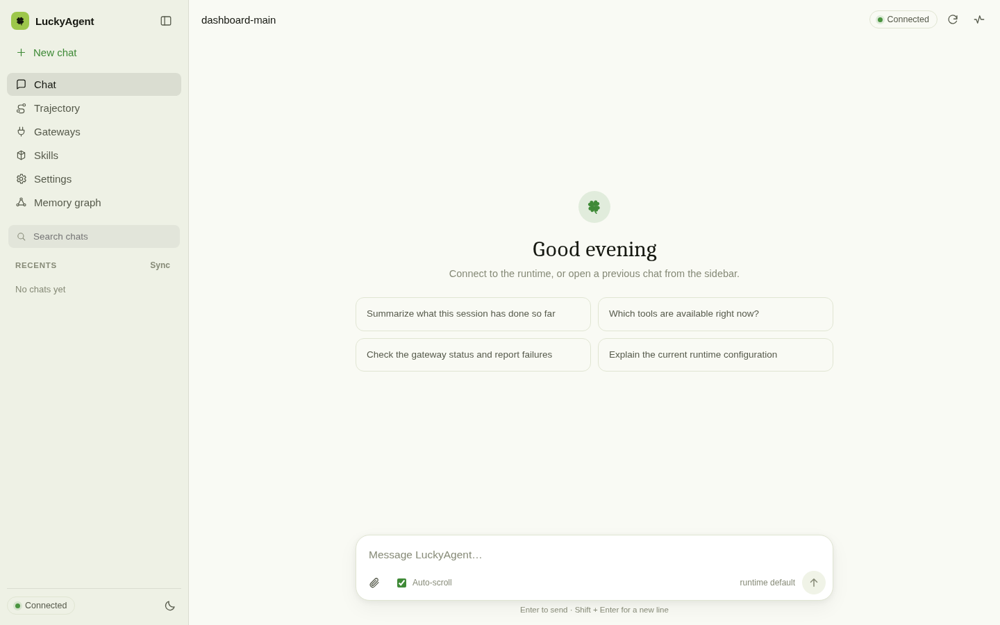
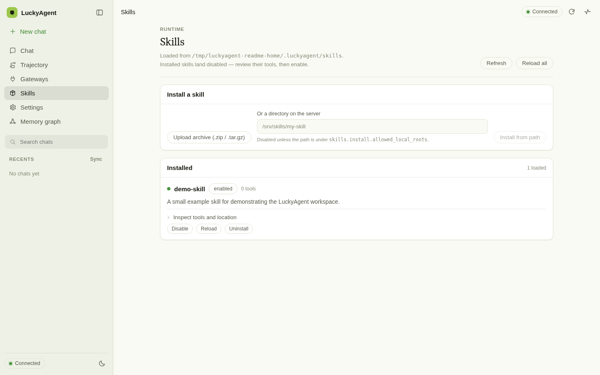
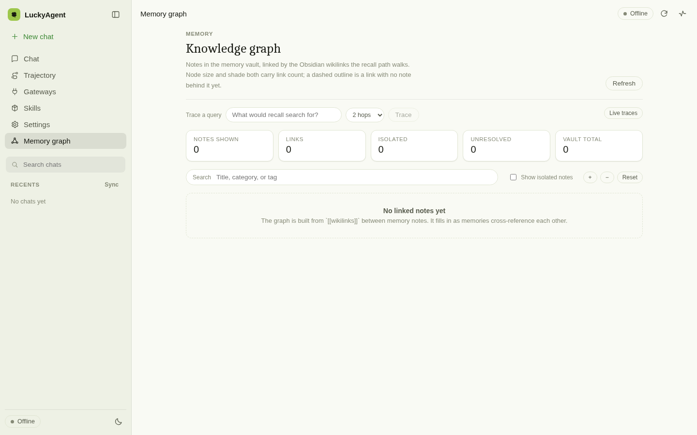
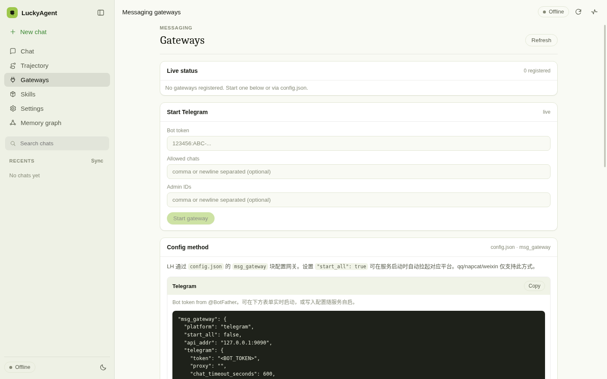

<div align="center">
  
</div>

# LuckyAgent

LuckyAgent 是一个用 Go 构建的长期运行 Agent runtime。它把 Agent loop、模型路由、工具和技能、长期记忆、RAG、HTTP API、TUI、GUI 以及消息网关放在同一个运行时里，支持从本地调试逐步走向容器和线上部署。

它不是只提供一个聊天窗口，而是提供一套可以观察、配置和持续运行的 Agent 基础设施。

<p align="center">
  <a href="https://github.com/yurika0211/lucky-agent">
    
  </a>
  <a href="public/Qgroup.png">
    
  </a>
  <a href="https://yurika0211.github.io/luckyagent/#config">
    
  </a>
  <a href="https://yurika0211.github.io/luckyagent/">
    
  </a>
  <a href="docs/API.md">
    
  </a>
</p>

## 界面预览

<p align="center">
  
  
</p>
<p align="center">
  
  
</p>

## 核心能力

- **统一运行时**：CLI、HTTP API、GUI、TUI 和消息网关共享同一个 Agent 核心。
- **长期记忆**：用 Obsidian-compatible Markdown vault 保存用户画像、事实、规则、决策和会话轨迹。
- **RAG 知识库**：索引项目文档、个人笔记和运维资料，并在 Agent 运行时检索。
- **工具与技能**：支持内置工具、技能加载、技能安装、MCP 和 OpenCLI。
- **多平台入口**：支持 Telegram、QQ Official、NapCat、飞书、微信和 OpenClaw Weixin。
- **可观察运行态**：GUI 提供会话、工具轨迹、Memory Graph、技能和网关工作区。
- **多 Agent 能力**：提供协作、委派和实验/benchmark 相关运行能力。

## 快速开始

### 环境要求

- Go 1.25+
- 一个可用的模型服务和对应 API 凭证
- 如果需要构建 GUI/TUI，需要 Node.js 和 npm

### 从源码运行

初始化运行目录：

```bash
go run ./cmd/la init
```

配置一个 OpenAI-compatible provider：

```bash
go run ./cmd/la config set provider openai
go run ./cmd/la config set api_key sk-your-api-key
go run ./cmd/la config set api_base https://api.openai.com/v1
go run ./cmd/la config set model gpt-5.4-mini
```

开始一次本地对话：

```bash
go run ./cmd/la chat "Hello, LuckyAgent"
```

启动 HTTP API：

```bash
go run ./cmd/la serve --addr 127.0.0.1:9090
```

健康检查：

```bash
curl http://127.0.0.1:9090/api/v1/health/live
```

默认运行配置位于：

```text
${HOME}/.luckyagent/config.json
```

容器或 systemd 部署时，请明确设置 `HOME`，并确保这个目录及其下的 `config.json`、sessions、memory、RAG 和 runtime 数据可持久化。

### GUI 和 TUI

构建 GUI 和 TUI：

```bash
cd UI
npm ci
npm run build
```

开发 GUI：

```bash
cd UI
npm run dev --workspace GUI
```

安装发行版后，可直接启动 TUI：

```bash
lh tui
```

源码运行 TUI：

```bash
go run ./cmd/la tui --api-base http://127.0.0.1:9090 --session dashboard-main
```

## 部署与安装

完整部署知识库已经独立到网页，包含：

- Linux、macOS、Windows 发布包安装
- 源码运行和运行目录规划
- 开发 Docker Compose
- 生产 Docker Compose 和 GHCR 镜像
- 镜像直跑、systemd 和长期运行
- Telegram、QQ、NapCat、飞书和微信网关
- 配置、健康检查、网络、鉴权和常见排障

请优先阅读：

[打开 LuckyAgent 部署知识库](https://yurika0211.github.io/luckyagent/)

仓库中也提供了两套 Compose：

```bash
# 开发环境：从当前源码构建
docker compose up -d --build luckyagent

# 生产环境：使用预构建镜像
docker compose -f docker-compose.prod.yml up -d luckyagent
```

生产环境启用消息网关时，使用对应 Compose profile：

```bash
docker compose -f docker-compose.prod.yml --profile telegram up -d
docker compose -f docker-compose.prod.yml --profile napcat up -d
```

不要把 README 中的简短命令当作完整生产配置。生产部署前应按照部署知识库确认 `HOME`、配置挂载、`server.addr`、端口、防火墙、访问白名单和网关 token。

## 常用命令

安装发行版后使用 `lh`；从源码运行时，将 `lh` 替换为 `go run ./cmd/la`：

```bash
lh init
lh config list
lh config get provider
lh config set model gpt-5.4-mini
lh chat
lh chat "Summarize this repository"
lh serve
lh tui
lh msg-gateway start --platform telegram
lh msg-gateway start --platform qqofficial
lh msg-gateway start --platform napcat
lh rag index ./docs
lh rag search "deployment"
```

## 文档导航

- [部署知识库](https://yurika0211.github.io/luckyagent/)
- [使用指南](docs/wiki/使用指南.md)：初始化、配置、CLI、API、GUI、TUI、网关和 Docker
- [特色功能](docs/wiki/特色功能.md)：记忆、RAG、工具、自动化和多 Agent
- [使用场景](docs/wiki/使用场景.md)：本地调试、知识库问答、机器人和团队 API
- [HTTP API](docs/API.md)
- [记忆系统](docs/memory_system.md)
- [Graph RAG 快速开始](docs/GRAPH_RAG_QUICKSTART.md)
- [多 Agent 协作](docs/multi-agent/collaboration.md)
- [Benchmark：Hybrid 检索](docs/benchmarks/rag-hybrid-retrieval/REPORT.md)：精确标识符 Recall@1 `0.000 → 1.000`，语义召回无回退，含延迟代价与复现步骤

## Prompt 和运行数据

运行时数据默认保存在 `${HOME}/.luckyagent`。其中：

```text
~/.luckyagent/
├── config.json
├── sessions/
├── memory/
├── skills/
├── rag/
├── logs/
├── runtime/
├── workspace/
└── knowledge/
```

Agent 的行为 prompt 位于：

```text
~/.luckyagent/memory/prompts/
```

常见文件包括 `SOUL.md`、`AGENTS.md`、`core.md`、`tool_policy.md`、`skill_policy.md` 和 `memory_policy.md`。修改 prompt 后，后续请求会使用新的内容，通常不需要重新编译程序。

本地开发或测试时，可以隔离运行目录：

```bash
HOME="$PWD/.lh-home" go run ./cmd/la chat "Test the local runtime"
```

## 项目结构

```text
cmd/la                   CLI 入口
internal/agent           Agent 核心运行时和 Agent loop
internal/config          配置加载、默认值和运行目录
internal/memory          Markdown 记忆 vault 和召回
internal/rag             RAG 索引、检索和持久化
internal/tool            工具、技能、MCP 和 OpenCLI
internal/server           HTTP API、SSE、WebSocket 和 Dashboard
internal/gateway          Telegram、QQ、飞书、微信等消息网关
UI/GUI                   GUI workspace
UI/TUI                   TUI workspace
docker-compose.yml       开发环境 Compose
docker-compose.prod.yml  生产环境 Compose
config.example.json      配置模板
```

## 开发

运行 Go 测试：

```bash
go test ./...
```

运行 GUI 校验：

```bash
cd UI/GUI
npm run typecheck
npm run build
```

如果需要修改 API、记忆、RAG、技能或消息网关，建议先阅读对应 package 和 `docs/` 下的专题文档，再运行相关 focused tests。

## License

[License](LICENSE)
